```mermaid
graph TD
    %% Level 2 - High Dependencies (Application Layer)
    CLI_LEGACY[rag_cli_legacy<br/>5 deps - LEGACY]
    PROMPT_PROV[enhanced_prompt_templates_providers<br/>2 deps - PROVIDER]

    %% Level 1 - Single Dependencies (Integration Layer)
    CLI[rag_cli<br/>1 dep]
    PROMPT_TEMPL[enhanced_prompt_templates<br/>1 dep]
    MODELS[multitenant_models<br/>2 deps]
    LANG_LEGACY[language_manager_legacy<br/>1 dep - LEGACY]

    %% Level 0 - Foundation (No Internal Dependencies)
    %% Core Infrastructure
    CONFIG[config_loader<br/>⭐ 3 dependents]
    CATEGORY[categorization<br/>⭐ 3 dependents]
    RAG_SYS[rag_system<br/>⭐ 2 dependents]

    %% Large Business Logic
    HIER_RET[hierarchical_retriever<br/>908 lines]
    RANKER[ranker<br/>891 lines]
    FOLDER_MGR[folder_manager<br/>774 lines]

    %% Providers (DI Pattern)
    CLEAN_PROV[cleaners_providers<br/>PROVIDER]
    SEARCH_PROV[search_providers<br/>PROVIDER]
    FOLDER_PROV[folder_manager_providers<br/>PROVIDER]

    %% Storage Layer
    STORAGE[storage]

    %% Dependencies Flow
    CLI_LEGACY --> MODELS
    CLI_LEGACY --> RAG_SYS
    CLI_LEGACY --> CONFIG
    CLI_LEGACY --> FOLDER_MGR
    CLI_LEGACY --> STORAGE

    PROMPT_PROV --> PROMPT_TEMPL
    PROMPT_PROV --> CATEGORY

    CLI --> RAG_SYS
    PROMPT_TEMPL --> CATEGORY
    MODELS --> CATEGORY
    MODELS --> CONFIG
    LANG_LEGACY --> CONFIG

    %% Styling
    classDef level2 fill:#ff6b6b,stroke:#d63031,stroke-width:3px,color:#fff
    classDef level1 fill:#fdcb6e,stroke:#e17055,stroke-width:2px
    classDef level0 fill:#6c5ce7,stroke:#5f3dc4,stroke-width:1px,color:#fff
    classDef critical fill:#00b894,stroke:#00a085,stroke-width:3px,color:#fff
    classDef legacy fill:#636e72,stroke:#2d3436,stroke-width:2px,color:#fff
    classDef provider fill:#fd79a8,stroke:#e84393,stroke-width:2px,color:#fff

    class CLI_LEGACY,PROMPT_PROV level2
    class CLI,PROMPT_TEMPL,MODELS,LANG_LEGACY level1
    class HIER_RET,RANKER,FOLDER_MGR,STORAGE level0
    class CONFIG,CATEGORY,RAG_SYS critical
    class CLI_LEGACY,LANG_LEGACY legacy
    class PROMPT_PROV,CLEAN_PROV,SEARCH_PROV,FOLDER_PROV provider
```

# RAG Service Dependency Visualization

## Legend
- 🔴 **Level 2** (Red): High dependencies - Application entry points
- 🟡 **Level 1** (Yellow): Single dependencies - Integration layer
- 🟣 **Level 0** (Purple): No dependencies - Foundation layer
- 🟢 **Critical** (Green): High-impact modules (multiple dependents)
- ⚫ **Legacy** (Gray): Legacy modules needing migration
- 🟦 **Provider** (Pink): Dependency injection pattern

## Key Insights

### 🎯 **Critical Path Analysis**
The dependency graph shows a **clean, acyclic hierarchy** with clear separation:

1. **Foundation Layer (Level 0)**: 64 modules providing core functionality
2. **Integration Layer (Level 1)**: 4 modules orchestrating business logic
3. **Application Layer (Level 2)**: 2 modules serving as entry points

### 🚨 **Risk Hotspots**
- **`rag_cli_legacy`**: Highest risk with 5 dependencies
- **`config_loader`**: Critical infrastructure with 3 dependents
- **`categorization`**: Core logic affecting 3 downstream modules

### 🏗️ **Architecture Quality**
✅ **Excellent**: No circular dependencies
✅ **Good**: Clear layered architecture
✅ **Maintainable**: Dependency injection patterns
⚠️ **Improvement needed**: 30% legacy code burden

---

*This visualization helps identify refactoring priorities and understand the impact of changes across the system.*
